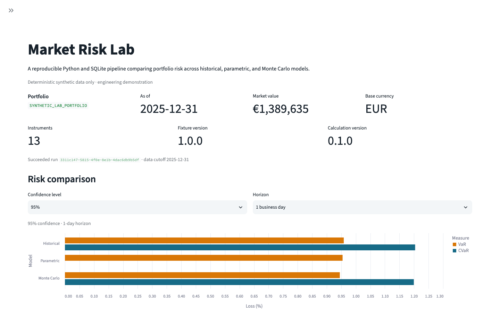

# Market Risk Lab

Market Risk Lab is a reproducible Python and SQLite pipeline for comparing portfolio
risk across historical, parametric, and Monte Carlo models. It demonstrates backend
engineering, deterministic data pipelines, financial-model validation, transactional
persistence, and a read-only analytical dashboard.

> **Synthetic data only.** This is an engineering demonstration—not realised portfolio
> performance, production risk infrastructure, regulatory reporting, investment advice,
> or a claim that these models are suitable for a particular portfolio.



## What it demonstrates

- Deterministic generation of a fictional multi-asset, multi-currency portfolio.
- Strict ingestion and explicit failure for missing prices, FX rates, or result coverage.
- Historical VaR/CVaR, parametric VaR, deterministic Monte Carlo VaR/CVaR, stress
  scenarios, and accurately named factor metrics.
- Explicit SQLite migrations, idempotent fixture loading, calculation-run lifecycle,
  canonical model identities, and atomic successful-result persistence.
- A local Streamlit dashboard that can read completed results but cannot calculate,
  migrate, load, or write.
- A reproducible local quality gate covering tests, typing, privacy, packaging, archive
  inspection, and clean-wheel installation.

## Quick start from a source checkout

Requires Python 3.12 and [uv](https://docs.astral.sh/uv/). All commands are local; no
market-data service or cloud account is required.

```bash
uv sync --frozen --extra dashboard

uv run market-risk-lab demo generate \
  --output-dir var/synthetic
uv run market-risk-lab db migrate \
  --database var/market-risk-lab.db
uv run market-risk-lab demo load \
  --data-dir var/synthetic \
  --database var/market-risk-lab.db
uv run market-risk-lab risk run \
  --database var/market-risk-lab.db
uv run market-risk-lab demo inspect \
  --database var/market-risk-lab.db
uv run market-risk-lab risk inspect \
  --database var/market-risk-lab.db
uv run --extra dashboard market-risk-lab dashboard \
  --database var/market-risk-lab.db
```

The generated fixtures and SQLite database live under ignored `var/`. Re-running the
migration and fixture-load commands is idempotent. Dashboard inspection opens SQLite
with `mode=ro`, `immutable=1`, and `query_only` and creates no journals.

Built wheels contain the Python package and CLI, but not repository-root demonstration
fixtures. The full demo therefore runs from a source checkout; the supported clean-wheel
smoke boundary is `market-risk-lab status`.

## Calculation methods

| Method | Implementation boundary |
|---|---|
| Historical VaR/CVaR | EUR-converted, constant-weight simple returns; overlapping compounded horizons; linear quantile and fractional-boundary empirical tail |
| Parametric VaR | Normal variance-covariance model with sample mean and covariance; no parametric CVaR |
| Monte Carlo VaR/CVaR | Seeded PCG64, daily multivariate log-return paths, deterministic under the lock and calculation version |
| Stress testing | Signed multiplicative local-asset and currency shocks with explicit coverage and uncovered instruments |
| Factor metrics | Beta, correlation, annualised volatility, tracking error, and conditional alpha against an explicit EUR-converted benchmark |

See [Methodology](docs/methodology.md) for formulas, sign conventions, assumptions, and
model limitations.

## Representative deterministic results

The default synthetic portfolio is valued at **€1,389,635** as of 2025-12-31. Under the
locked environment, representative 95% loss estimates are:

| Model measure | 1 day | 10 days |
|---|---:|---:|
| Historical VaR | 0.96% | 2.92% |
| Historical CVaR | 1.20% | 3.54% |
| Parametric VaR | 0.95% | 2.76% |
| Monte Carlo VaR | 0.95% | 2.66% |
| Monte Carlo CVaR | 1.20% | 3.42% |

These values describe one deterministic fictional dataset. They are neither forecasts nor
recommendations. Parametric CVaR is deliberately unavailable rather than represented as
zero.

## Architecture

The system flows from a versioned synthetic specification through deterministic fixtures,
validation, SQLite, calculation orchestration, atomic result persistence, and a read-only
dashboard. Write-capable CLI operations and read-only presentation are separated by an
explicit trust boundary.

See [Architecture](docs/architecture.md) for the data-flow diagram, layer responsibilities,
run lifecycle, provenance model, and deferred scope.

## Engineering highlights

- **Deterministic input pipeline:** fixed seed, ordering, precision, UTF-8, and LF output.
- **Historically correct FX treatment:** local prices are converted to EUR before returns
  and portfolio aggregation.
- **Strict completeness:** missing series, ambiguous shocks, zero benchmark variance,
  incomplete succeeded runs, and invalid covariance fail explicitly.
- **Migration-driven SQLite:** schema versions are ordered, explicit, and idempotent.
- **Model-safe identity:** run, method, variant, confidence, horizon, canonical parameters,
  and SHA-256 parameter hash prevent result collisions.
- **Lifecycle and provenance:** pending → running → succeeded/failed transitions retain
  fixture, cutoff, seed, package, model, and completion metadata.
- **Atomic results:** a successful run becomes visible only after risk, stress, and factor
  results commit together; failures record a sanitized reason without partial success.
- **Read-only presentation:** the dashboard selects succeeded runs through immutable,
  query-only SQLite connections and never invokes calculation services.
- **Reproducible validation:** `uv run python tools/quality_gate.py` runs frozen install,
  formatting, linting, strict typing, tests, coverage, deterministic end-to-end execution,
  scanning, package inspection, and clean-wheel smoke testing.
- **Separated release controls:** the candidate owns only generic public-safe scanning;
  confidential literals and private hashes remain in a sibling directory outside any
  future worktree.

## Testing and release safety

The branch-enabled suite covers calculations, FX conversion, validation, transactions,
run failures, deterministic replay, dashboard read-only behavior, CLI integration, scanner
false positives/negatives, workflow policy, and package boundaries. The enforced threshold
is 80% combined coverage; the verified baseline is 84.51% statement, 65.17% branch, and
81.06% combined coverage.

The future GitHub Actions workflow has read-only contents permission, immutable action
pins, no deployment or schedule, and no artifact retention. Its configuration is locally
verified, but no badge is shown because the repository and first live workflow run are not
yet authorised.

Run the complete local gate:

```bash
uv run python tools/quality_gate.py
```

## Limitations and non-claims

- Fixed as-of weights create a hypothetical risk series, not realised performance.
- The business-day calendar omits exchange-specific holidays.
- Models omit non-linear instruments, liquidity, transaction costs, changing holdings,
  volatility regimes, jumps, tail dependence, and broader model-risk governance.
- Overlapping historical horizons are dependent observations.
- Normal and log-normal assumptions can materially understate real tail risk.
- Stress scenarios are illustrative synthetic shocks, not forecasts.
- The local dashboard has no authentication, multi-user isolation, deployment hardening,
  telemetry backend, or external market-data integration.
- PRIIPs, CRM, SRI, regulatory reporting, Turso/libSQL, scheduled writers, NAV/Excel
  ingestion, and cloud deployment are outside this MVP.

## Project structure

```text
data/synthetic/                   Versioned synthetic specification and fixtures
docs/                             Architecture, methodology, synthetic-data notes, ADRs
src/market_risk_engine/data/      Generation, validation, and FX conventions
src/market_risk_engine/risk/      Portfolio preparation and risk models
src/market_risk_engine/storage/   SQLite migrations, transactions, and queries
src/market_risk_engine/dashboard/ Read-only adapter and Streamlit presentation
tests/                            Unit, integration, scanner, and policy tests
tools/                            CI-equivalent gate and public-safe scanner
```

## Documentation

- [Architecture](docs/architecture.md)
- [Methodology](docs/methodology.md)
- [Synthetic data](docs/synthetic-data.md)
- [Architecture decision records](docs/adr/)

## Licence

Licensed under the [Apache License 2.0](LICENSE).
