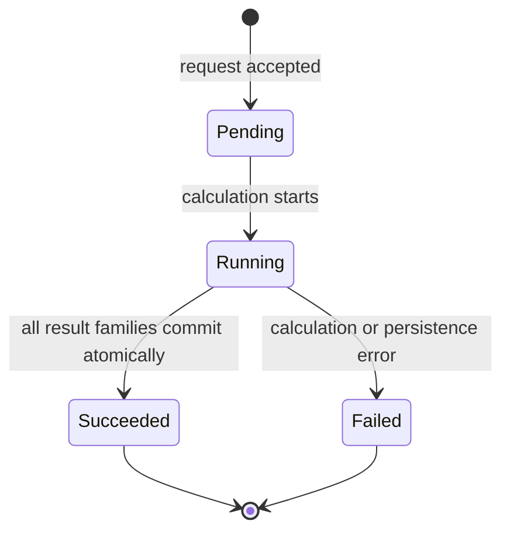

# Architecture

Market Risk Lab is a local, SQLite-first risk-engineering demonstration using only deterministic synthetic inputs. Calculation and presentation are deliberately separated: write-capable commands create versioned results, while the dashboard can only inspect an existing database through a read-only adapter.

## Data flow and trust boundaries

```mermaid
flowchart LR
    Spec["Synthetic TOML specification"] --> Generator["Deterministic fixture generator"]
    Generator --> Fixtures["Synthetic CSV fixtures"]
    Fixtures --> Validation["Typed validation and completeness checks"]
    Validation --> SQLite["SQLite migrations and fixture tables"]
    SQLite --> Service["Calculation service"]
    Service --> Models["Historical, parametric, Monte Carlo, stress, factors"]
    Models --> Atomic["Atomic succeeded-run results"]
    Service --> Failed["Sanitized failed-run record"]
    Atomic --> ReadOnly["Read-only SQLite adapter"]
    ReadOnly --> Dashboard["Local Streamlit dashboard"]
    CLI["CLI write boundary"] --> Generator
    CLI --> SQLite
    CLI --> Service

    subgraph WriteZone["Write-capable local pipeline"]
        Generator
        Fixtures
        Validation
        SQLite
        Service
        Models
        Atomic
        Failed
    end

    subgraph PresentationZone["Read-only presentation boundary"]
        ReadOnly
        Dashboard
    end
```



The dashboard opens the selected database using SQLite URI `mode=ro`, `immutable=1`, and `PRAGMA query_only`. It imports neither fixture generation nor calculation orchestration and has no interface for migrations, loading, calculation execution, status transitions, or result writes. Refresh explicitly reruns immutable queries; no live connection is cached.

## Layer responsibilities

| Layer | Responsibility |
|---|---|
| Domain | Strict typed instruments, positions, prices, FX rates, run states, and shared validation |
| Ingestion/data | Parse the synthetic specification, generate byte-stable fixtures, validate schemas and cross-file completeness, and enforce the EUR-per-quote FX convention |
| Risk | Prepare the effective portfolio and EUR histories; calculate historical, parametric, Monte Carlo, stress, and factor results without persistence side effects |
| Storage | Apply ordered SQLite migrations, enforce foreign keys, load fixtures idempotently, manage transactions, and persist/query run results |
| Orchestration | Create a run, transition pending → running, calculate all outputs in memory, atomically persist success, or record a sanitized failure |
| CLI | Expose explicit generation, migration, loading, calculation, inspection, dashboard, and status commands with actionable failures |
| Presentation | Select only succeeded runs, reject incomplete result sets, create deterministic view models, and render persisted values without writes |

## Calculation-run lifecycle



`pending` and `running` runs have no completion timestamp. `succeeded` requires a completion timestamp and no failure reason. `failed` requires a completion timestamp and a sanitized, non-empty reason. The service computes risk, stress, and factor outputs before opening the success transaction, so partial outputs cannot appear as a successful run. A separate failure transition records operational failure after calculation or commit errors.

## Result identity and provenance

A risk result is identified by:

```text
run ID + method + model variant + confidence + horizon + canonical parameter hash
```

Canonical JSON uses sorted keys and compact separators, then SHA-256. Persisted provenance also includes the full parameter JSON, calculation/package version, fixture version, data cutoff, effective position date, portfolio ID, base currency, random seed, timestamps, stress scenario version, benchmark, and optional risk-free-rate treatment. This distinguishes otherwise similar results and makes deterministic comparisons auditable.

## Read/write boundaries

- `demo generate`, `db migrate`, `demo load`, and `risk run` are explicit write-capable CLI operations.
- `demo inspect` and `risk inspect` validate that the database already exists; inspection cannot create a file or parent directory.
- The dashboard uses a separate read-only connection path and cannot invoke write services.
- Only succeeded and complete runs are presented as calculations. Pending, running, and failed runs never supply displayed risk results.
- Generated fixtures and databases used by demos and tests live under ignored or temporary directories and are not package artifacts.

## Public/private release separation

The public candidate has a fresh-history strategy and contains only original generic code, deterministic synthetic data, public documentation, and generic scanning rules. Confidential release controls—including private literals and prohibited hashes—remain in a separate sibling directory that is neither a worktree nor a parent of the candidate. No private Git object, source file, dataset, documentation, or history is part of the candidate.

## MVP boundary and deferred capabilities

The MVP is Python 3.12, SQLite, deterministic local fixtures, a CLI, and a local read-only Streamlit dashboard. It does not claim production, regulatory, compliance, or investment readiness.

Deferred Track B capabilities include typed Turso/libSQL storage, scheduled deterministic refresh, generic NAV/Excel ingestion, standards-backed PRIIPs Category 2 MRM/VEV and optional CRM-to-SRI calculation, expanded reporting, deployment hardening, SBOM and provenance attestations, benchmarks, and telemetry. These are not partially implemented in the MVP.
